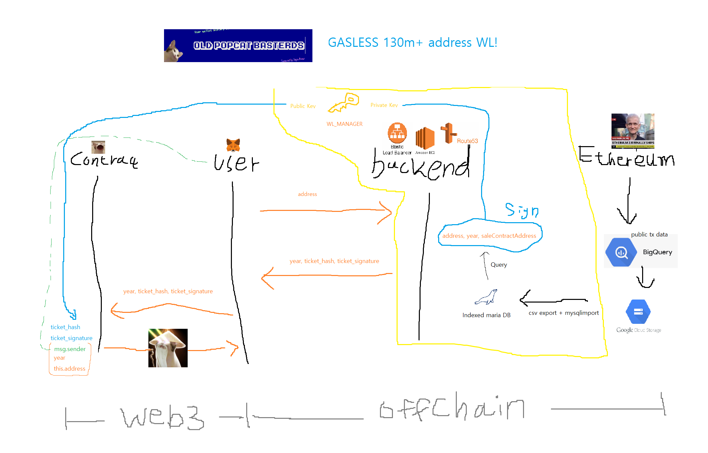

# old-popcat-basterds-server
OPB Gasless WL server




### API DOCS
- API DOCS 링크는 요청시 개별 전달

#### 응답코드 요약

- `200` 정상 응답
 
  

- `418` 서버는 커피를 찻 주전자에 끓이는 것을 거절합니다

  

- `400` 서버에서 정의되지 않은 예외 발생


### 서명 객체
```
[
    'address',
    'uint256',
    'address'
],
[
    wallet.address,
    new Date(wallet.first_tx_time).getFullYear(),
    process.env.SALE_CONTRACT_ADDRESS,
]
```
서명은 WL_MANAGER Key로 Sign되었으며, 서버에서 전달받은 `ticket_hash` 를 컨트렉트에 전달 시 아래와 같이 uint8array로 형변환이 필요함


```
let ticket_hash_binary = await ethers.utils.arrayify(ticket_hash);
```
